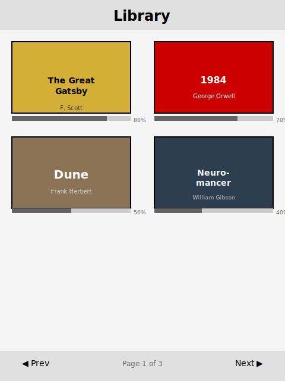
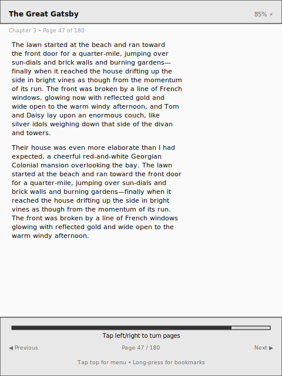
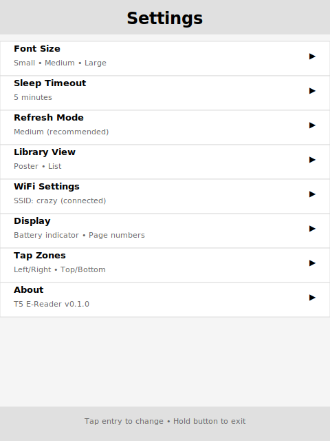
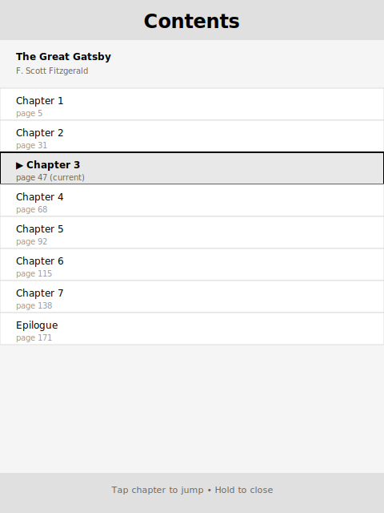

# T5 E-Reader

**A feature-rich EPUB reader firmware for the LilyGo T5 4.7" ESP32-S3 e-ink display.**

[](https://platformio.org/)
[](LICENSE)
[](https://www.espressif.com/en/products/socs/esp32-s3)

> Rendered mockup screenshots below. Replace with actual device photos once hardware is validated.

| Library (Poster View) | Reader | Settings |
|---|---|---|
|  |  |  |

| Table of Contents |
|---|
|  |

---

## Hardware

| Component | Details |
|-----------|---------|
| **Board** | [LilyGo T5 4.7" V2.3 / V2.4](https://www.lilygo.cc/products/t5-4-7-inch-e-paper-v2-3) (PCB 2024-01-15) |
| **MCU** | ESP32-S3-WROOM-1-N16R8 (16MB flash, 8MB OPI PSRAM) |
| **Display** | ED047TC1 4.7" e-ink (960x540, parallel via epdiy) |
| **Touch** | GT911 capacitive (I2C 0x14/0x5D, auto-detect) |
| **RTC** | PCF8563 (shares I2C bus with touch) |
| **Storage** | SD card (SPI, FAT32) |
| **WiFi** | 802.11 b/g/n (for wireless book upload) |

Both V2.3 and V2.4 board revisions are supported — identical GPIO assignments, fully interchangeable.

---

## Features

### Reading
- **EPUB reader** with chapter-by-chapter navigation and text pagination
- **Font size presets** — Small, Medium, Large with adjusted line spacing and margins
- **Inline image rendering** for EPUB images (decoded and cached to SD)
- **Partial e-ink refresh** for fast page turns, with periodic full refresh to clear ghosting
- **Progress bar** and page/chapter counters in the footer
- **Bookmark indicator** in the header (asterisk when current page is bookmarked)

### Library
- **List view** and **poster/cover art view** — toggle in settings
- **Continue Reading** banner highlighting the last-opened book
- **Progress badges** showing read percentage on each book
- **Paginated navigation** with Prev/Next buttons for large libraries
- **Metadata caching** for fast library scans on subsequent boots

### Navigation & UI
- **Portrait-first UI** (540x960) — rotated from the landscape hardware
- **Touch zones** — tap left/right thirds to turn pages, tap header for menu
- **Table of Contents (TOC)** — jump to any chapter from the reader menu
- **Bookmarks** — add, remove, and jump to saved positions
- **Reading statistics** — total time and pages read per book
- **Configurable tap zone layout** — left/center/right or top/mid/bottom

### WiFi Upload
- **Built-in web server** (port 80) for managing books wirelessly
- Upload EPUB files and custom sleep images from any browser
- Delete books directly from the web interface
- **Full-text search** within the currently open book
- Update WiFi credentials from the web UI (saved to SD)

### Power Management
- **Deep sleep** after configurable timeout (default: 5 minutes)
- **Sleep/wake** via GPIO 21 top button (hold ~600ms to sleep)
- **Touch wake** from deep sleep via GT911 interrupt
- **Custom sleep screen** images loaded from SD card
- **Battery percentage** displayed in the reader header

### Settings (persistent on SD)
- Font size, sleep timeout, refresh interval
- Page numbers and battery display toggles
- Tap zone layout
- Library view mode (list or poster)
- WiFi SSID and password

---

## Getting Started

### Prerequisites

- [PlatformIO](https://platformio.org/) — VS Code extension or CLI
- USB-C cable for flashing
- MicroSD card (FAT32 formatted)

### Setup

1. **Clone the repository**
   ```bash
   git clone https://github.com/YOUR_USERNAME/t5-ereader-firmware.git
   cd t5-ereader-firmware
   ```

2. **Configure WiFi credentials**
   ```bash
   cp include/config.h.example include/config.h
   ```
   Edit `include/config.h` and set your WiFi SSID and password:
   ```cpp
   #define WIFI_SSID "your-wifi-ssid"
   #define WIFI_PASS "your-wifi-password"
   ```

3. **Prepare the SD card**
   - Format as FAT32
   - Create a `/books/` folder at the root
   - Copy `.epub` files into `/books/`
   - (Optional) Create `/sleep_images/` and add `.png` or `.jpg` files for custom sleep screens

4. **Build and flash**
   ```bash
   pio run --target upload
   ```

5. **Monitor serial output** (optional, for debugging)
   ```bash
   pio device monitor
   ```

The device will boot to the library screen showing your books.

---

## Usage

### Library Screen
- **Tap a book** to open it
- **Prev / Next** buttons at the bottom for paginated browsing
- **Continue Reading** banner appears at the top if you have a book in progress
- **Settings** button at the bottom opens the settings screen

### Reading a Book
- **Tap right third** of screen — next page
- **Tap left third** — previous page
- **Tap header area** (top of screen) — opens the reader menu overlay

### Reader Menu
The menu overlay shows the book title, progress, and reading statistics:
- **Table of Contents** — jump to any chapter
- **Bookmarks** — view, add, or remove bookmarks
- **Add/Remove Bookmark** for the current page
- **Back to Library** — return to the library screen

### Sleep / Wake
- **Hold the top button** (GPIO 21) for ~600ms to enter deep sleep
- **Press the button** or **touch the screen** to wake up
- The device auto-sleeps after 5 minutes of inactivity (configurable)

### WiFi Upload
1. Open **Settings** from the library screen
2. Tap **Upload** to start WiFi mode
3. The device connects to your configured WiFi and displays an IP address
4. Open that IP in any browser on the same network
5. Upload `.epub` files or sleep images, delete books, search, or update WiFi settings
6. Return to the library when done — new books appear automatically

---

## Configuration

### `include/config.h`

All hardware pin definitions, display dimensions, UI layout constants, font spacing presets, and timeouts are defined here. The only values you must change are the WiFi credentials. Everything else has sensible defaults for the T5 4.7" hardware.

### PlatformIO Build

The project uses `platformio.ini` with:
- **Platform**: espressif32@6.4.0 (ESP-IDF 5.x — avoids LCD bus init bugs in ESP-IDF 6.0)
- **Board**: `lilygo_t5_47_s3_n16r8` (custom board definition in `boards/`)
- **Framework**: Arduino
- **PSRAM**: OPI mode enabled
- **Flash**: 16MB with custom partition scheme

### Partition Scheme

| Partition | Type | Size |
|-----------|------|------|
| nvs | data | 20KB |
| otadata | data | 8KB |
| app0 | app (OTA) | 8MB |
| spiffs | data | ~8MB |

The large app partition accommodates the firmware with embedded fonts and the miniz decompression library.

---

## Project Structure

```
t5-ereader-firmware/
├── include/
│   ├── config.h              # Your config (git-ignored)
│   └── config.h.example      # Template — copy to config.h
├── src/
│   ├── main.cpp              # State machine, touch handling, screen rendering
│   ├── display.h/cpp         # epdiy display driver wrapper
│   ├── touch.h/cpp           # GT911 touch polling
│   ├── epub.h/cpp            # ZIP reader + EPUB parser + HTML text extraction
│   ├── reader.h/cpp          # Text pagination, progress, bookmarks, statistics
│   ├── library.h/cpp         # SD card book scanner + metadata cache
│   ├── cover_renderer.h/cpp  # EPUB cover art extraction and rendering
│   ├── inline_image.h/cpp    # Inline EPUB image decoding and display
│   ├── wifi_upload.h/cpp     # WiFi web server for book management
│   ├── settings.h/cpp        # Persistent settings (JSON on SD)
│   ├── sleep_image.h/cpp     # Custom sleep screen renderer
│   ├── storage_utils.h/cpp   # Atomic file write helpers
│   ├── battery.h/cpp         # ADC battery voltage reading
│   ├── font_small.h          # Embedded font — small preset
│   ├── font_medium.h         # Embedded font — medium preset
│   ├── font_large.h          # Embedded font — large preset
│   └── miniz.c/h             # ZIP decompression (vendored)
├── boards/
│   └── lilygo_t5_47_s3_n16r8.json  # Custom PlatformIO board definition
├── data/                     # SPIFFS data (if any)
├── platformio.ini            # Build configuration
├── partitions.csv            # Custom partition table
├── CHANGELOG.md
├── LICENSE
└── README.md
```

---

## Pin Assignments

| Function | GPIO |
|----------|------|
| Touch SDA | 18 |
| Touch SCL | 17 |
| Touch INT | 47 |
| SD CS | 42 |
| SD MOSI | 15 |
| SD MISO | 16 |
| SD SCLK | 11 |
| Battery ADC | 14 |
| Button (sleep/wake) | 21 |
| EPD I2C SDA | 39 |
| EPD I2C SCL | 40 |

Display data bus pins are managed internally by the LilyGo-EPD47 library.

---

## Known Limitations

- **Early release** (v0.1.0) — functional but expect rough edges
- **EPUB support** — text-centric; complex CSS layouts and some nested formatting may not render perfectly
- **No true power-off** — the top button triggers deep sleep (very low power), but true off requires the physical slide switch on the board
- **GT911 quirks** — the touch controller I2C address may appear as 0x5D or 0x14 depending on power-on state; firmware auto-detects both
- **ESP-IDF version** — pinned to ESP-IDF 5.x (espressif32@6.4.0) due to LCD bus init bugs in ESP-IDF 6.0

## Roadmap

- Cloud sync / integration
- Additional font choices
- Annotation and highlighting support
- Dictionary lookup
- OTA firmware updates

---

## Contributing

Contributions are welcome! Please:

1. Fork the repository
2. Create a feature branch (`git checkout -b feature/my-feature`)
3. Commit your changes
4. Open a Pull Request

If you find a bug specific to the T5 4.7" hardware, please open an issue with your board revision (V2.3 or V2.4) and a serial log if possible.

---

## License

[MIT License](LICENSE) — Copyright (c) 2026 Eric Antonson / Yeti Wurks LLC
