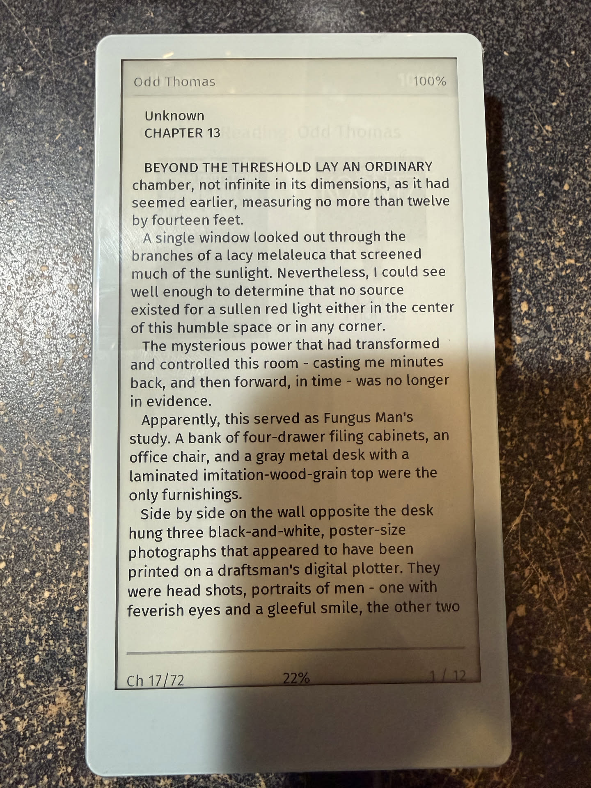

# T5 E-Reader

EPUB reader firmware for the LilyGo T5 4.7 inch ESP32-S3 e-paper board.

[](https://platformio.org/)
[](LICENSE)
[](https://www.espressif.com/en/products/socs/esp32-s3)

## Status

Current firmware version: **v0.3.1**

This branch is tuned for the real device workflow now in code:
- portrait UI on the 960x540 panel
- SD-backed library, progress, settings, and line cache storage
- optional custom sleep images from the SD card
- wake/resume behavior that preserves the recent reader state
- single top-button navigation model: short press forward, double press back, long press sleep
- in-device OTA update screen backed by GitHub Releases

## Hardware

| Component | Details |
|-----------|---------|
| Board | LilyGo T5 4.7 inch V2.3 / V2.4 |
| MCU | ESP32-S3-WROOM-1-N16R8 |
| Display | ED047TC1 4.7 inch e-paper, 960x540 |
| Touch | GT911 capacitive touch |
| Storage | MicroSD over SPI, FAT32 |
| WiFi | 2.4 GHz 802.11 b/g/n |

## Features

### Reading
- EPUB parsing with chapter navigation and pagination
- Seven font size levels: XS, S, M, ML, L, XL, XXL
- Serif (Noto Serif) and sans-serif (Fira Sans) font toggle — configurable in Settings
- Inline image rendering from EPUB content
- Fast partial refresh for most page turns with stronger cleanup refreshes on cadence
- Reader progress bar, chapter indicator, page indicator, and optional battery display
- Bookmarks

### Library
- List view and poster view
- Filter tabs: ALL, NEW, READING, DONE
- OPDS client — browse and download books from Calibre servers or Project Gutenberg
- Gutenberg genre browser with scrollable category picker (no keyboard required)
- Continue Reading banner for the most recently active book
- Per-book progress badges

### Power and sleep
- Deep sleep after configurable inactivity timeout
- Wake feedback banner before the restored UI is drawn
- Optional sleep images loaded from `/sleep`
- If `/sleep` is missing, empty, or has no usable images, the firmware falls back to the built-in default sleep screen

### WiFi upload
- Built-in web UI for uploading books and sleep images
- Delete books from the browser UI
- WiFi credentials stored in settings

## SD Card Layout

After a successful SD mount, the firmware now ensures the app folders below exist automatically:

```text
/
├── books/
│   ├── *.epub
│   ├── .library_cache.json
│   ├── .settings.json
│   ├── .progress/
│   │   └── <book>.json
│   └── .linecache/
│       └── ch<chapter>.txt
└── sleep/
    ├── *.png
    └── *.jpg
```

Notes:
- `/books` is the main library folder.
- `/books/.progress` stores reading position and last-read order.
- `/books/.linecache` stores wrapped chapter text on SD to reduce RAM pressure.
- `/sleep` is optional from a user perspective, but the firmware auto-creates it when the SD card mounts successfully.
- If there are no valid images in `/sleep`, the device still sleeps normally and shows the built-in fallback screen.

## Controls

### Top physical button (GPIO 21)
- **Long press (~600 ms)**: enter deep sleep
- **Short press**: forward
- **Double press**: back

More specifically:
- In the reader, short press goes to the next page and double press goes to the previous page.
- In the library, short press goes to the next library page and double press goes to the previous library page.

### Touch controls

#### Library
- Tap a book to open it
- Tap the footer button to open Settings
- Swipe left/right to change library pages
- Tap Continue Reading to reopen the most recent book with progress

#### Reader
- Swipe left: next page
- Swipe right: previous page
- Tap left third: previous page
- Tap right third: next page
- Tap center third: open the in-book menu/settings overlay
- Long-press center third: add a bookmark for the current page

#### Reader menu
- Table of Contents
- Bookmarks
- Settings
- Library
- Tap outside the menu items to resume reading

## Screenshots

The current screenshots are copied into `docs/screenshots/` so they render inline on GitHub.

### Start Up Screen


### Library Screen


### Reading Screen


### Settings Screen


### Sleep Screen


### Sleep Wake Up Screen


### Book Settings Page
- Screenshot not found in the available media storage yet.
- Placeholder preserved so the section is ready once the asset turns up.

## Sleep image workflow

Sleep images are loaded only from `/sleep` on the SD card.

Supported formats confirmed in the current code:
- `.png`
- `.jpg`
- `.jpeg`

How it works:
1. Put image files in `/sleep`, or upload them through the WiFi page.
2. On sleep, the firmware scans `/sleep`, sorts the filenames, and picks the next image in rotation.
3. The selected image is decoded, scaled to fit the portrait display, and centered.
4. Color images are converted to grayscale for the e-paper panel.
5. If the chosen file fails to open or decode, the firmware tries the next image.
6. If no usable images remain, the device falls back to the built-in default sleep screen.

Practical guidance:
- Recommended image size: **540x960** pixels in portrait orientation for best results.
- The firmware scales other sizes to fit while preserving aspect ratio, so exact sizing is not required.
- Files larger than roughly **8 MB** are rejected by the current code path.
- Custom sleep images are optional; sleep still works without them.

## OTA updates

OTA support is present in the firmware and release workflow, but it was **not end-to-end validated on hardware in this release-prep pass**. Treat it as available code that still deserves a real-device verification.

Current OTA flow in the firmware:
1. Open **Settings** on the device.
2. Tap **Firmware Update**.
3. The device connects to WiFi if needed, checks the repository's latest GitHub release, and compares that tag to the running firmware version.
4. If a newer release is found and it includes a `firmware.bin` asset, the device offers installation.
5. Tap to install, wait for the download to complete, and the device restarts when the update succeeds.

Current release-side expectations:
- Releases are driven by Git tags like `v0.2.1`.
- The GitHub Actions release workflow builds the `gh_release` PlatformIO environment.
- That workflow uploads `.pio/build/gh_release/firmware.bin` to the GitHub release.
- The device-side OTA checker expects that `firmware.bin` asset name.

If OTA does not find an update, check these first:
- WiFi credentials are saved and working.
- A newer GitHub release tag exists.
- The release contains a `firmware.bin` asset.

## Setup

### Prerequisites
- PlatformIO CLI or VS Code PlatformIO extension
- USB-C cable
- FAT32-formatted microSD card

### Configure WiFi

```bash
cp include/config.h.example include/config.h
```

Then edit `include/config.h` and set:

```cpp
#define WIFI_SSID "your-wifi-ssid"
#define WIFI_PASS "your-wifi-password"
```

### Prepare storage
- Format the SD card as FAT32
- Copy EPUB files into `/books`, or place them at SD root if needed
- Optionally add PNG/JPG sleep images into `/sleep`
- The firmware will create its hidden working folders automatically on first successful mount

## Build

Main hardware environment:

```bash
pio run -e lilygo-t5-47-s3
```

Flash the connected device:

```bash
pio run -e lilygo-t5-47-s3 -t upload
```

Serial monitor:

```bash
pio device monitor -b 115200
```

## What to expect on boot

- The board shows the splash screen on cold boot.
- Serial output reports SD mount status and whether required folders already existed or were created.
- The library loads from SD.
- On wake from deep sleep, the device shows a small wake banner first, then restores the reader or library screen.
- If the previous book can be reopened safely, the reader resumes there; otherwise the firmware falls back to the library.

## Project structure

```text
t5-ereader-firmware/
├── include/
│   ├── config.h
│   └── config.h.example
├── src/
│   ├── main.cpp
│   ├── library.cpp / library.h
│   ├── reader.cpp / reader.h
│   ├── sleep_image.cpp / sleep_image.h
│   ├── settings.cpp / settings.h
│   ├── wifi_upload.cpp / wifi_upload.h
│   ├── display.cpp / display.h
│   ├── touch.cpp / touch.h
│   ├── epub.cpp / epub.h
│   ├── cover_renderer.cpp / cover_renderer.h
│   ├── inline_image.cpp / inline_image.h
│   ├── battery.cpp / battery.h
│   ├── ota_update.cpp / ota_update.h
│   ├── storage_utils.cpp / storage_utils.h
│   └── miniz.c / miniz.h
├── boards/
├── data/
├── tools/
├── platformio.ini
├── partitions.csv
├── CHANGELOG.md
└── README.md
```

## Known limitations

- EPUB support is text-first and will not perfectly reproduce complex CSS-heavy layouts.
- True power-off still requires the hardware power switch; the top button enters deep sleep.
- Large or malformed books may still take time to process when opening chapters.

## License

MIT
